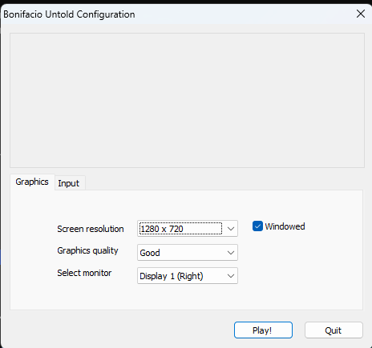
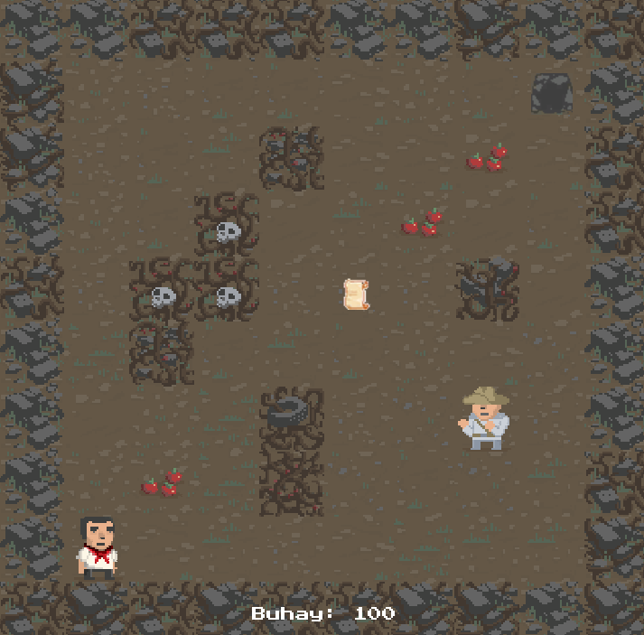
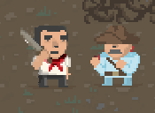

# Bonifacio Untold# Bonifacio Untold
A simple game we made using Unity for a History class. It follows Andres Bonifacio and his quest to collect Jose Rizal's writings.

# Running the Game
1. Clone this project locally
2. Run `Bonifacio Untold.exe`
```powershell
& './Bonifacio Untold.exe' 
```

The Bonifacio Untold Configuration window should show up.


Click "Play!" and the game should start.

# Gameplay

Your goal is to collect all of Jose Rizal’s writings and survive for as many days (Araw) as possible.

## Moving around

You move Andres Bonifacio using WASD or arrow keys. Every movement consumes -1 point from his Buhay (life).



For each Araw, you need to go to the top-right bunker to proceed to the next Araw.

## Surviving

To recover Buhay, you need to eat berries or get a writing. 

A berry would give you +20 Buhay while a writing would give you +10 buhay.

## Attacking a target

To attack, you move towards the target.

You can either hit an obstacle or an enemy Guwardiya Sibil. After a few hits, you can destroy an obstacle or an enemy.



Be careful of enemy Guwardiya Sibil, though, as you could take damage when they land a hit. A gray Guwardiya Sibil could hit you for -10 Buhay, while a blue Guwardiya Sibil could hit you for -20 Buhay.